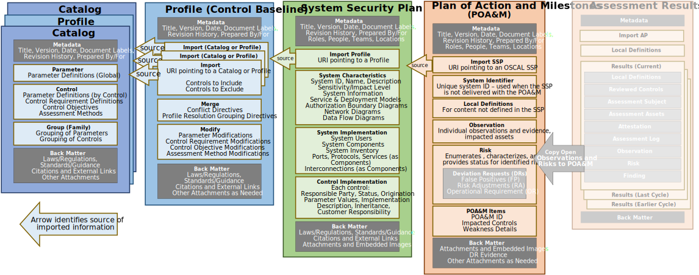

| POA&M Schema | POA&M Converters
|:--- |:--- |
| [XML Schema](https://raw.githubusercontent.com/usnistgov/OSCAL/master/xml/schema/oscal_poam_schema.xsd) | [JSON to XML Converter](https://raw.githubusercontent.com/usnistgov/OSCAL/master/xml/convert/oscal_poam_json-to-xml-converter.xsl) ([How do I use this?](https://github.com/usnistgov/OSCAL/tree/master/xml#converting-oscal-json-content-to-xml)) |
| [JSON Schema](https://raw.githubusercontent.com/usnistgov/OSCAL/master/json/schema/oscal_poam_schema.json) | [XML to JSON Converter](https://raw.githubusercontent.com/usnistgov/OSCAL/master/json/convert/oscal_poam_xml-to-json-converter.xsl) ([How do I use this?](https://github.com/usnistgov/OSCAL/tree/master/json#converting-oscal-xml-content-to-json)) |

| [XML](), [JSON]() | [XML to JSON](), [JSON to XML]()

## Purpose

The OSCAL Plan of Action and Milestones (POA&M) model defines the information contained within a POA&M.

## Authors and Consumers

### POA&M Authors

System Information System Security Officers (ISSOs)

ISSOs use a POA&M to identify risks to the system and track remediation activities on behalf of the system owner.

### POA&M Consumers

System Owners, Authorizing Officials, Continuous Monitoring Practitioners, Customers

System owners consume the POA&M to understand the risk posture of their system, and ensure remediation activities are occurring as planned.

Authorizing officials consume the POA&M in the adjudication of a system as part of approving an authorization to operate, and periodically to ensure the system continues to operate in a secure manner.

Continuous monitoring practitioners consume the POA&M as part of monitoring the system's security posture.

##  POA&M Organization

{}
{}
{}
An OSCAL POA&M is organized as follows:
- **Metadata**: Metadata syntax is identical and required in all OSCAL models. It includes information such as the file's title, publication version, publication date, and OSCAL version. Metadata is also used to define roles, parties (people, teams and organizations), and locations.
- **Import SSP**: Identifies the OSCAL-based SSP of the system being assessed. Several pieces of information about a system that normally appear in the POA&M are now referenced via this import statement.
- **System Identifier**: Intended when a POA&M is not delivered with an SSP, this allows a continuous monitoring organization to uniquely identify the system associated with this POA&M.
- **Local Definitions**: Allows for the local definition of components and inventory items within the POA&M when they reference items not found in the associated SSP, such as the discovery of undocumented hosts, and a citation of the scanning tool used to identify a vulnerability.
- **Risk**: Identifies individual risks, including weakness description, risk statement, and other risk characteristics. Risk deviations, such as false positive identification, risk adjustments and risk acceptance (operational requirement) are also identified as part of the risk itself.
- **POA&M Items**: Enumerates each individual POA&M item. Each entry includes the risk information, plan for remediation, and status. Where applicable, deviation information is also included.
- **Back Matter**: Back matter syntax is identical in all OSCAL models. It is used for attachments, citations, and embedded content such as graphics.
{}
{}

{}
{}
{}

## Key Concepts

The OSCAL Plan of Action and Milestones (POA&M) model is part of the [OSCAL Results Layer](/documentation/schema/assessment-results-layer/). It defines structured, machine-readable XML, JSON, and YAML representations of the information contained within a POA&M.

This model is used by anyone responsible for tracking and reporting compliance issues or risks identified for a system, typically on behalf of a system owner.

This model supports details typically associated with a POA&M, including source of discovery, risk description and recommendations, remediation planning/tracking, and disposition status. It also supports deviations, such as false positive (FP), risk acceptance, and risk adjustments (RA).

An OSCAL POA&M is always defined in the context of a specific system. It must either be associated with an OSCAL [System Security Plan (SSP)](/documentation/schema/implementation-layer/ssp/), or reference a system by unique identifier.

The current version of this model was created based on the information requirements of a [FedRAMP POA&M](https://www.fedramp.gov/assets/resources/templates/FedRAMP-POAM-Template.xlsm).

It was designed to use identical syntax to the [assessment results model](/documentation/schema/assessment-results-layer/assessment-results/), for overlapping assemblies (results: observations and risks), which allows easy transfer of identified risks for an assessment report to a POA&M.

The figure below represents the portion of the OSCAL stack as it relates to an OSCAL POA&M.


